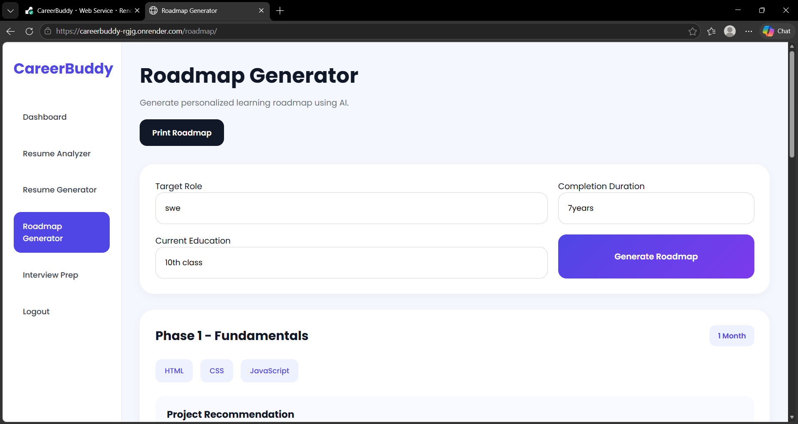
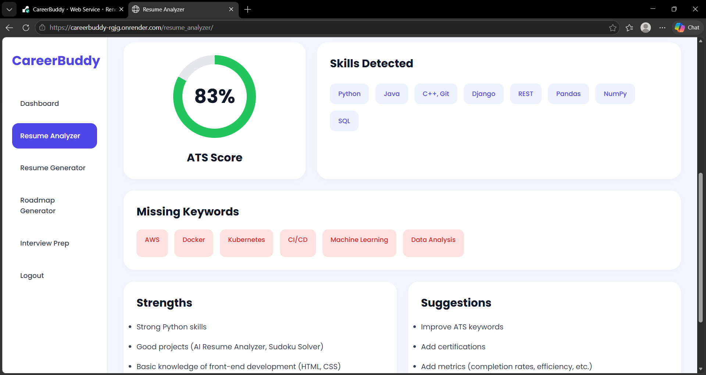
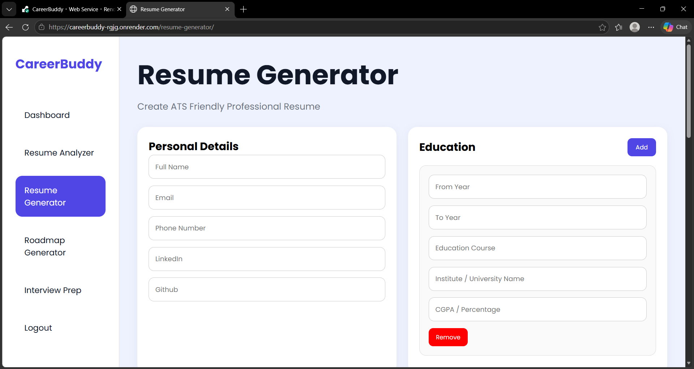
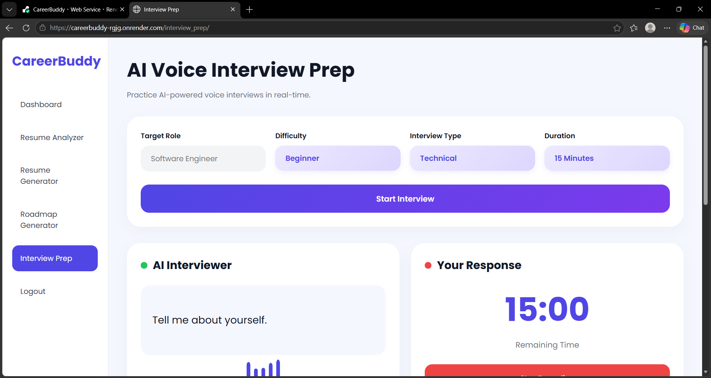
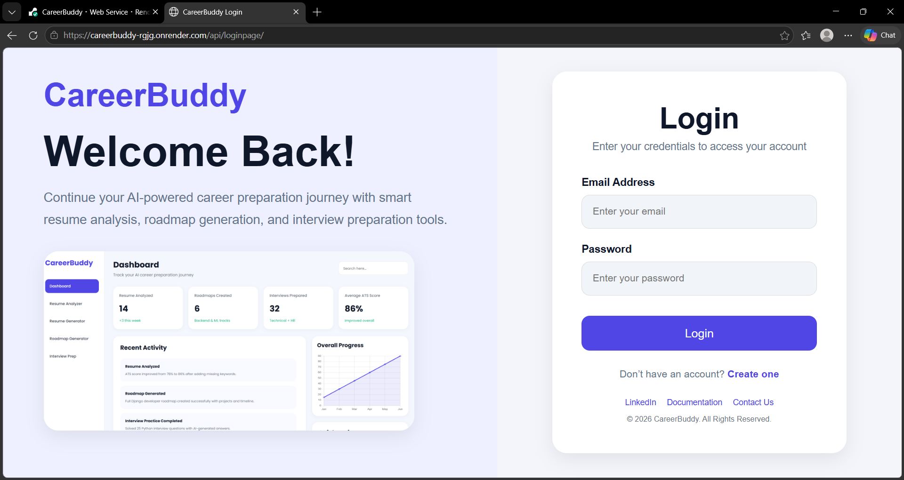
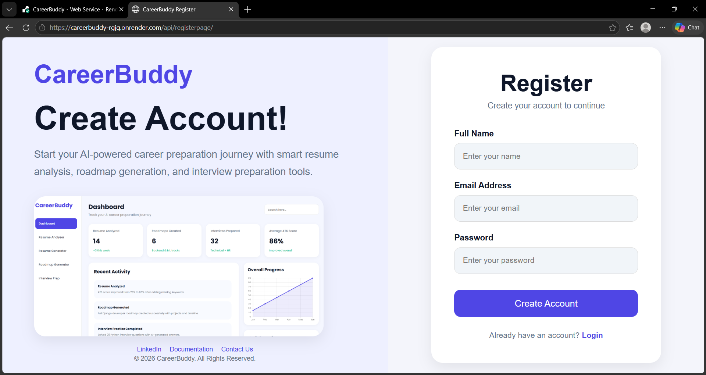
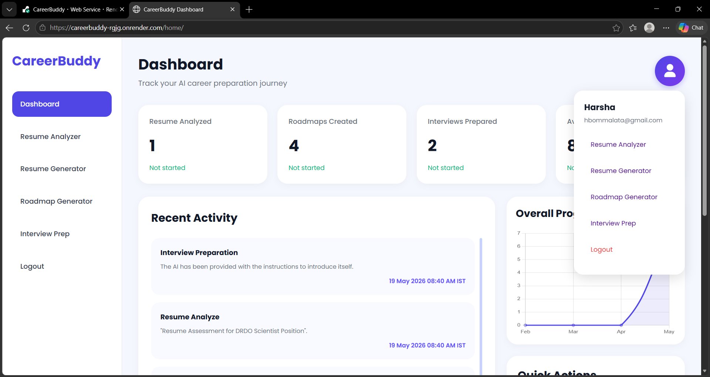

# CareerBuddy

CareerBuddy is an AI-powered career guidance platform made for students and job seekers.  
It helps users improve resumes, prepare for interviews, generate career roadmaps, and build resumes using AI.

Example:
- A student who wants to become a Web Developer can generate a complete learning roadmap.
- A fresher can upload a resume and check ATS score.
- A job seeker can practice interview questions using voice interaction.

---

# Live Website

https://careerbuddy-rgjg.onrender.com

---

# Features

## 1. AI Roadmap Generator

Users can generate a career roadmap based on their selected role.

Example:
- Input: Frontend Developer
- Output:
  - HTML
  - CSS
  - JavaScript
  - React
  - Projects
  - Interview Preparation

The roadmap is generated step-by-step using AI.

### Screenshot



---

## 2. Resume Analyzer

Users can upload resumes in PDF format.

The system analyzes:
- Skills
- Education
- Projects
- Experience
- Certifications
- Resume Quality

Example:
- Missing skills are highlighted
- Weak sections are identified
- Improvement suggestions are shown

### Screenshot



---

## 3. ATS Score Checker

The platform checks whether a resume is ATS-friendly.

Example:
- ATS Score: 78%
- Suggestions:
  - Add more technical skills
  - Improve project descriptions
  - Add certifications

### Screenshot


---

## 4. Resume Builder

Users can create resumes directly inside the platform.

Example sections:
- Personal Information
- Education
- Skills
- Projects
- Experience
- Certifications

Generated resume can be downloaded easily.

### Screenshot



---

## 5. AI Interview Preparation

Users can practice interviews using AI-generated questions.

Example:
- Role: Python Developer
- Difficulty: Beginner
- Type: Technical Interview

The system asks questions and records user voice responses.

### Screenshot



---

## 6. Speech Recognition Support

Voice input is supported using browser speech recognition.

Example:
- User speaks answer using microphone
- System records response automatically

---

## 7. User Authentication

Users can:
- Register
- Login
- Access personalized features

### Screenshot





---

## 8. Dashboard System

The dashboard helps users manage and track their activities in one place.

Example:
- View recent resume analyses
- Track generated roadmaps
- Access interview preparation tools
- Navigate all platform features easily

### Screenshot



---

---

# Technologies Used

## Frontend
- HTML
- CSS
- JavaScript

## Backend
- Django
- Django REST Framework

## Database
- SQLite3
- postgreSQL

## AI APIs
- Groq API

## Deployment
- Render

---

# Project Structure

```bash
CareerBuddy/
│
├── api/
├── careerbuddy/
├── static/
├── templates/
├── manage.py
├── requirements.txt
├── Procfile
└── README.md
```

---

# Installation

## Step 1: Clone Repository

```bash
git clone https://github.com/harshavardhanBOMMALATA/CareerBuddy.git
```

---

## Step 2: Move into Project Folder

```bash
cd CareerBuddy
```

---

## Step 3: Install Required Packages

```bash
pip install -r requirements.txt
```

---

## Step 4: Run Django Server

```bash
python manage.py runserver
```

---

# Environment Variables

Add these variables during deployment.

```env
GROQ_API_KEY=your_api_key
SECRET_KEY=your_secret_key
DEBUG=False
```

Example:
- GROQ_API_KEY is used for AI responses
- SECRET_KEY is used for Django security

---

# Example Workflow

## Example 1: Roadmap Generation

Input:
```txt
Data Scientist
```

Output:
- Python
- NumPy
- Pandas
- Machine Learning
- Deep Learning
- Projects
- Interview Questions

---

## Example 2: Resume Analysis

Input:
```txt
Upload Resume PDF
```

Output:
- ATS Score
- Missing Skills
- Suggestions
- Resume Strength

---

## Example 3: Interview Preparation

Input:
- Role: Java Developer
- Difficulty: Intermediate

Output:
- AI-generated interview questions
- Voice recording support
- Practice environment

---

# Future Improvements

- PostgreSQL Database
- Better AI Feedback
- Real-time Interview Evaluation
- More Resume Templates
- Admin Dashboard
- User Analytics

---

# Developer

Developed by Harshavardhan Bommalata

## Contact

### LinkedIn
https://www.linkedin.com/in/harshavardhan-bommalata-7bb9442b0

### GitHub
https://github.com/harshavardhanBOMMALATA

### Email
hbommalata@gmail.com

---

# License

This project is created for educational, learning, and portfolio purposes.
